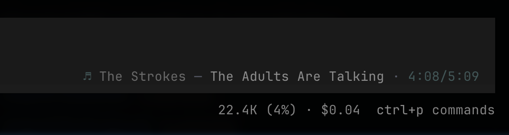

# Agent DJ

Spotify now-playing in your agent statusline — [OpenCode](https://opencode.ai) and [Claude Code](https://claude.ai/code).

**OpenCode**



**Claude Code**


```text
♪ The Strokes — The Adults Are Talking · 4:08/5:09
```

## Install

```sh
curl -fsSL https://raw.githubusercontent.com/AdamPSU/agent-dj/main/install.sh | bash
dj auth
```

Install puts **`dj`** on your PATH (installs [`uv`](https://docs.astral.sh/uv/) if needed). Run **`dj auth`** and multi-select agents.

### Spotify app (once)

1. Create an app in the [Spotify Developer Dashboard](https://developer.spotify.com/dashboard).
2. Add a loopback redirect (`http://127.0.0.1/callback` — login uses an ephemeral local port).
3. Paste the **Client ID** when auth asks (saved to `~/.agent-dj/config.json`).

### OpenCode

`dj on` / `dj auth` copies the TUI plugin to `~/.config/opencode/plugins/agent-dj`, writes `~/.agent-dj/opencode_runtime.json`, and registers the plugin in `~/.config/opencode/tui.json` (and project `.opencode/tui.json` when present). Restart OpenCode after enabling so the TUI reloads plugins.

## Use

```sh
dj auth     # Client ID + Spotify login + multi-select agents to enable
dj on       # multi-select agents to enable
dj off      # multi-select agents to disable
dj palette  # show or set artist/song/time colors
dj help
```

### Palette

Optional colors for **artist → song → time** (hex `#RGB` or `#RRGGBB`):

```sh
dj palette                              # show current
dj palette '#888888' '#C1C1C1' '#486E6F'
dj palette --reset
```

Or in `~/.agent-dj/config.json`:

```json
"palette": ["#888888", "#C1C1C1", "#486E6F"]
```

### Statusline

Spotify is polled at most every **5 seconds**; progress is interpolated while playing and frozen while paused. Claude Code runs `dj tick` ~0.5s; the OpenCode chip shells `dj tick --json` on the same cadence.

## Local storage

Under `~/.agent-dj/`:

| Path | Purpose |
|------|---------|
| `config.json` | Spotify client ID (mode 600) |
| `spotify_tokens.json` | OAuth tokens (mode 600) |
| `now_playing.json` | Short-lived now-playing cache |
| `statusline.json` | Claude Code statusline marker |
| `opencode_runtime.json` | OpenCode plugin command path |

OpenCode plugin: `~/.config/opencode/plugins/agent-dj`.

Env `SPOTIFY_CLIENT_ID` overrides the config file if set.

## Package layout

```text
src/backend/
  cli.py
  auth_wizard.py   # multi-agent auth/on/off
  agents.py
  config.py
  spotify.py
  tracker.py
  claude/          # Claude Code integration
  opencode/        # OpenCode + TUI plugin sources
    statusline.py
    plugin/
```

## Development

```sh
git clone https://github.com/AdamPSU/agent-dj
cd agent-dj
uv sync
uv run pytest
uv run dj auth
```
