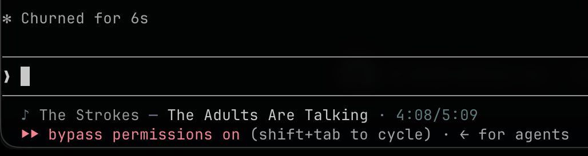

# Agent DJ

Show the current Spotify track in the [Claude Code](https://claude.ai/code), [OpenCode](https://opencode.ai), and [Pi](https://github.com/badlogic/pi-mono) statusline.



## Features

- Works with Claude Code, OpenCode, and Pi (multi-select at setup)
- Polls Spotify at most every 5 seconds; progress ticks between polls while playing
- Optional colors for artist, song, and time
- OAuth tokens and config stored under `~/.agent-dj/` (mode 600)

## Requirements

- Python 3.12+
- [uv](https://docs.astral.sh/uv/)
- A Spotify Developer app with redirect URI `http://127.0.0.1/callback`
- Claude Code, OpenCode, and/or Pi installed

## Install

```sh
uv tool install git+https://github.com/AdamPSU/agent-dj
dj auth
```

`dj auth` asks for your Spotify Client ID, opens the browser login, then lets you enable agents.

### Spotify app (one time)

1. Create an app in the [Spotify Developer Dashboard](https://developer.spotify.com/dashboard).
2. Add redirect URI `http://127.0.0.1/callback` (login binds an ephemeral local port).
3. Enter the Client ID when `dj auth` prompts (saved to `~/.agent-dj/config.json`).

`SPOTIFY_CLIENT_ID` overrides the value in the config file when set.

### OpenCode

`dj auth` / `dj on` install the TUI plugin to `~/.config/opencode/plugins/agent-dj`, write `~/.agent-dj/opencode_runtime.json`, and register the plugin in `~/.config/opencode/tui.json` (and a project `.opencode/tui.json` if one exists). Restart OpenCode after enabling so the TUI reloads plugins.

### Pi

`dj auth` / `dj on` copy the extension to `~/.pi/agent/extensions/agent-dj.ts` and write `~/.agent-dj/pi_runtime.json`. Restart Pi or run `/reload`. The song sits below the powerline and above the last-prompt replay. `/dj placement above|below|toggle` moves it; so does `dj placement`.

## Usage

```sh
dj auth       # Spotify login + choose agents to enable
dj on         # enable statusline for selected agents
dj off        # disable statusline for selected agents
dj palette    # show or set artist / song / time colors
dj placement  # show or set Pi widget placement (above|below)
dj help
```

### Palette

Colors are artist, song, then time. Hex forms `#RGB` and `#RRGGBB` are accepted.

```sh
dj palette
dj palette '#888888' '#C1C1C1' '#486E6F'
dj palette --reset
```

Or in `~/.agent-dj/config.json`:

```json
{
  "palette": ["#888888", "#C1C1C1", "#486E6F"]
}
```

### Placement (Pi)

```sh
dj placement
dj placement below
dj placement above
```

Or in `~/.agent-dj/config.json`:

```json
{
  "pi_placement": "below"
}
```

In Pi: `/dj placement above|below|toggle`.

### Statusline refresh

Claude Code runs `dj tick` about twice a second. OpenCode and Pi poll on the same cadence. Spotify itself is queried at most every 5 seconds; progress is interpolated while the track is playing. When nothing is playing the line shows a gray paused message.

## Configuration files

| Path | Purpose |
|------|---------|
| `~/.agent-dj/config.json` | Spotify client ID, optional palette, Pi placement |
| `~/.agent-dj/spotify_tokens.json` | OAuth tokens |
| `~/.agent-dj/now_playing.json` | Short-lived now-playing cache |
| `~/.agent-dj/statusline.json` | Claude Code statusline marker |
| `~/.agent-dj/opencode_runtime.json` | OpenCode plugin command and palette |
| `~/.agent-dj/pi_runtime.json` | Pi extension command and placement |

OpenCode plugin directory: `~/.config/opencode/plugins/agent-dj`.
Pi extension: `~/.pi/agent/extensions/agent-dj.ts`.

## Project layout

```text
src/
  backend/           # CLI, Spotify, tracker, agent integrations
    claude/          # Claude Code statusline hook
    opencode/        # OpenCode install + TUI plugin
    pi/              # Pi extension install
  tests/
```

## Development

```sh
git clone https://github.com/AdamPSU/agent-dj
cd agent-dj
uv sync
uv run pytest
uv run dj auth
```

## License

[Apache License 2.0](LICENSE)
