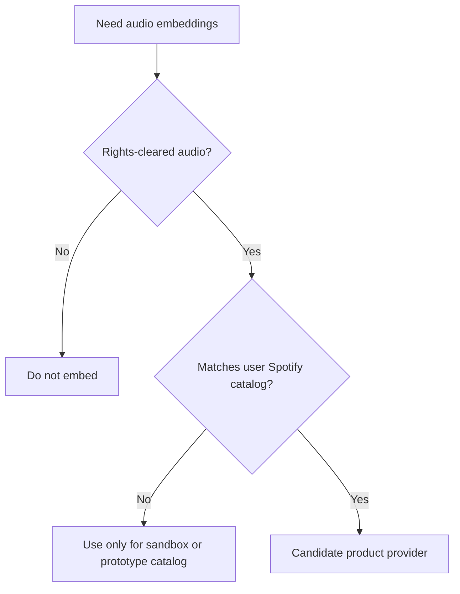

This page is the canonical provider research record for Claude DJ audio embeddings. Update it directly when new provider evidence appears.

## Decision Summary

Current product rule: keep the main Spotify DJ useful without mandatory embeddings, and only populate vector data from sources with explicit rights for the intended analysis and storage.

## Provider Matrix

| Provider or source | Useful for | Current decision | Evidence URL |
| --- | --- | --- | --- |
| Spotify | Playback, playlist sync, metadata, current state | Use for playback/catalog; do not use as audio or ML ingestion source. | https://developer.spotify.com/policy |
| Apple Music API | Catalog, library, recommendations, playback history, ISRC filtering, previews | Not a default embedding source; developer-token path and rights are not clean enough for normal local users. | https://developer.apple.com/documentation/applemusicapi/ |
| iTunes Search API | Public preview lookup | Not viable as ISRC resolver because documented lookup support is insufficient for this flow. | https://performance-partners.apple.com/search-api |
| Deezer API | ISRC-to-preview prototype resolver | Technically useful for local prototype only; not product default without explicit permission. | https://developers.deezer.com/api/track |
| Feed.fm Music API | Licensed app playback and SDK integration | Interesting licensed playback provider; not automatically an embedding source. | https://www.feed.fm/music-api |
| Feed Clips | Licensed major-label clips | Not usable for embeddings under public terms because AI use and caching are prohibited. | https://www.feed.fm/clips-terms-conditions |
| Feed Originals | Owned functional catalog | Possible sandbox catalog if permission covers analysis and embeddings. | https://www.feed.fm/originals |
| MassiveMusic | Enterprise licensed music delivery | Possible funded-enterprise route only if contract permits ML inference and embedding storage. | https://docs.massivemusic.com/reference/introduction |
| Tuned Global | B2B streaming infrastructure | Better fit for a full streaming service than a tiny local plugin. | https://www.tunedglobal.com/streaming-services/streaming-music-api-for-apps |
| SourceAudio | Customer catalog API and AI dataset marketplace | Best fit for explicitly cleared dataset licensing, likely enterprise. | https://www.sourceaudio.com/api/ |
| Jamendo API | Independent/open-catalog experiments | Candidate for non-mainstream experiments; licenses must be checked per use. | https://developer.jamendo.com/v3.0/tracks |
| MTG-Jamendo Dataset | Research music tagging dataset | Good research/prototype source, not mainstream playlist coverage. | https://mtg.github.io/mtg-jamendo-dataset/ |
| Freesound | Sound/sample experiments | Good for sounds under per-item licenses, not a song catalog match. | https://freesound.org/help/tos_api/ |
| Epidemic Sound | Licensed production music | Not a workaround unless using sanctioned API/terms that explicitly permit analysis. | https://www.epidemicsound.com/policy/general-terms-and-conditions/ |
| Cyanite | AI music tagging/search API | Useful market reference; customers supply rights-cleared catalog. | https://cyanite.ai/blog/music-analysis-api/ |
| Musiio | AI tagging/search for supplied audio | Useful market reference; not an audio source. | https://docs.musiio.com/tag/ |
| AIMS API | Similarity/search for customer catalogs | Useful for catalog owners, not a mainstream audio source. | https://www.aimsapi.com/ |
| MusicAtlas | Embeddings/search/recommendation infrastructure | Requires a supplied catalog. | https://musicatlas.ai/intelligence/music-search-api-what-you-can-build |

## Model Research Notes

| Model or paper | Current relevance | Evidence URL |
| --- | --- | --- |
| MuQ | Current local prototype model; promising for music representations, but public weights are not a clean commercial default if non-commercially licensed. | https://arxiv.org/abs/2501.01108 |
| MuQ GitHub | Official implementation; confirms code/checkpoint access path. | https://github.com/tencent-ailab/MuQ |
| CLAP | Baseline audio-text embedding direction; useful background, not current implementation. | https://arxiv.org/abs/2206.04769 |
| Audio representation recommender comparisons | Support the idea that pretrained music/audio representations can help recommender tasks, but no paper solves licensing. | https://arxiv.org/abs/2604.23077 |
| Perceptual music similarity embeddings | Suggests audio-only and audio-text embeddings can be strong perceptual similarity baselines. | https://arxiv.org/abs/2601.19109 |

## Update Rule

When new provider information arrives, update this page directly. Do not recreate a separate research-note tree. If the change affects implementation, update [Provider-Gated Audio Embeddings](../concepts/provider-gated-audio-embeddings.md) and [Roadmap](../roadmap.md) in the same change.
