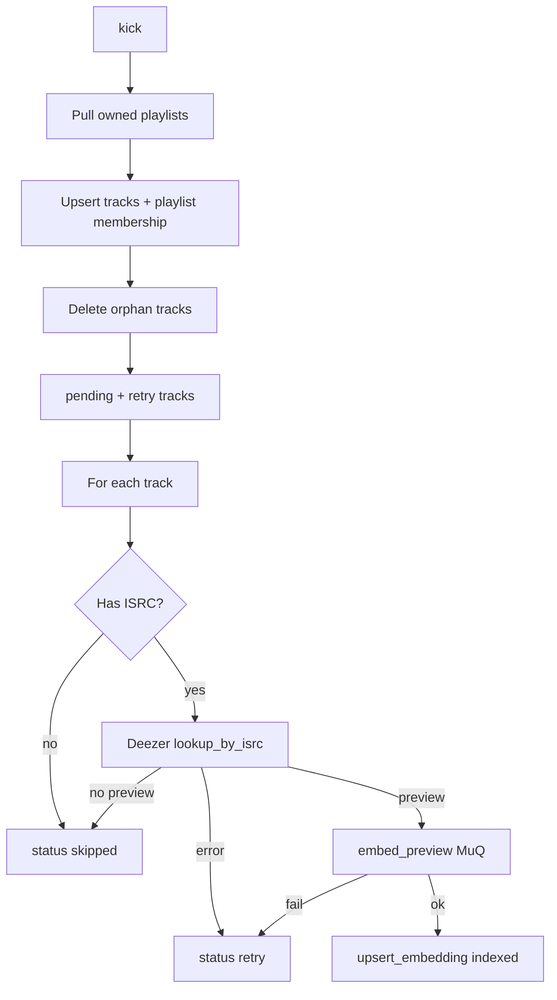

Catalog sync is the background pipeline that turns **owned Spotify playlists** into a local searchable music catalog with embeddings.

## Trigger

- `POST /play` and `POST /sync` both call `catalog_sync.kick()`.[^1]
- `kick()` starts at most one background thread (single-flight).[^2]

## Pipeline

## Rules

| Rule | Detail |
|------|--------|
| Owned only | Playlist `owner.id == /me.id` — followed playlists excluded[^3] |
| Snapshot skip | Unchanged `snapshot_id` skips re-fetch of that playlist’s items[^2] |
| Sequential embed | One preview → embed at a time (model cost / simplicity)[^2] |
| Statuses | `pending` → `indexed` \| `skipped` \| `retry`[^4] |

## Progress

`/status` exposes `syncing`, `current` (name/artists of track being embedded), and per-status track counts for a future statusline — the CLI does not pretty-print readiness.[^1]

## Related

- [Spotify adapter](../entities/spotify-adapter.md)
- [Deezer adapter](../entities/deezer-adapter.md)
- [MuQ embeddings](../entities/muq-embeddings.md)
- [Local storage](local-storage.md)

[^1]: backend/daemon.py
[^2]: backend/sync.py
[^3]: backend/adapters/spotify.py
[^4]: backend/storage/db.py

