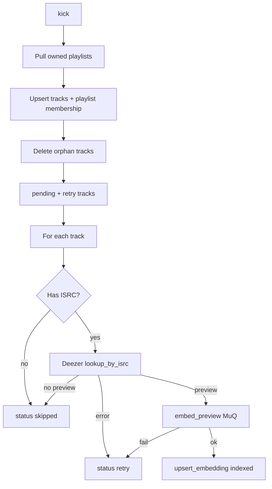

Catalog sync turns **owned Spotify playlists** into a local searchable catalog with embeddings (`claude_dj/catalog/sync.py`).

## Trigger

- `POST /play` and `POST /sync` both call `catalog_sync.kick()`.[^1]
- `kick()` starts at most one background thread (single-flight).[^2]

## Pipeline

## Rules

| Rule | Detail |
|------|--------|
| Owned only | Playlist `owner.id == /me.id` |
| Snapshot skip | Unchanged `snapshot_id` skips re-fetch |
| Sequential embed | One preview → embed at a time |
| Statuses | `pending` → `indexed` \| `skipped` \| `retry` |

## Progress

`/status` exposes `syncing`, indexed counts, `now_playing` for CLI and statusline.[^1]

## Related

- [Spotify adapter](../entities/spotify-adapter.md)
- [Deezer adapter](../entities/deezer-adapter.md)
- [MuQ embeddings](../entities/muq-embeddings.md)
- [Local storage](local-storage.md)

[^1]: claude_dj/daemon/server.py
[^2]: claude_dj/catalog/sync.py
