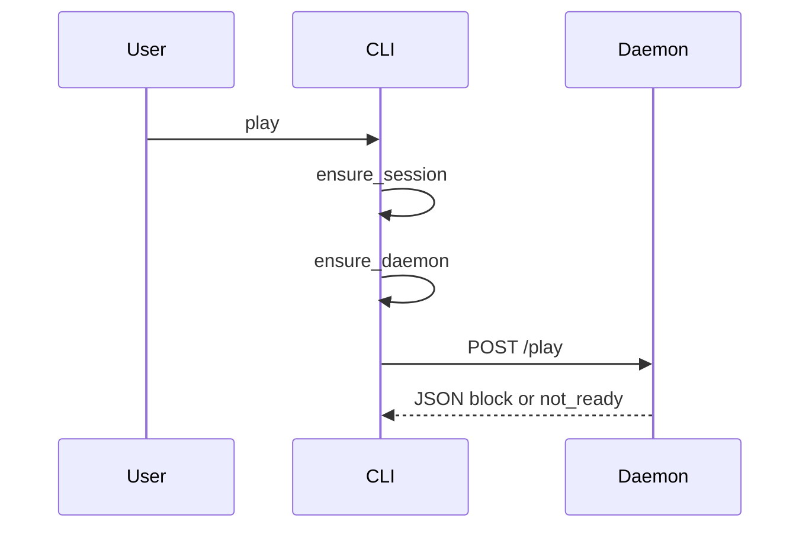

CLI client + localhost HTTP daemon.

## Commands → HTTP

| CLI | HTTP |
|-----|------|
| play | POST `/play` (+ auth + spawn) |
| status | GET `/status` |
| sync | POST `/sync` |
| device | GET `/devices` |
| device id | POST `/devices/{id}` |
| quit | POST `/quit` |

Host/port from `backend/config.py`.[^1]

[^1]: backend/cli.py; backend/daemon.py; backend/config.py

