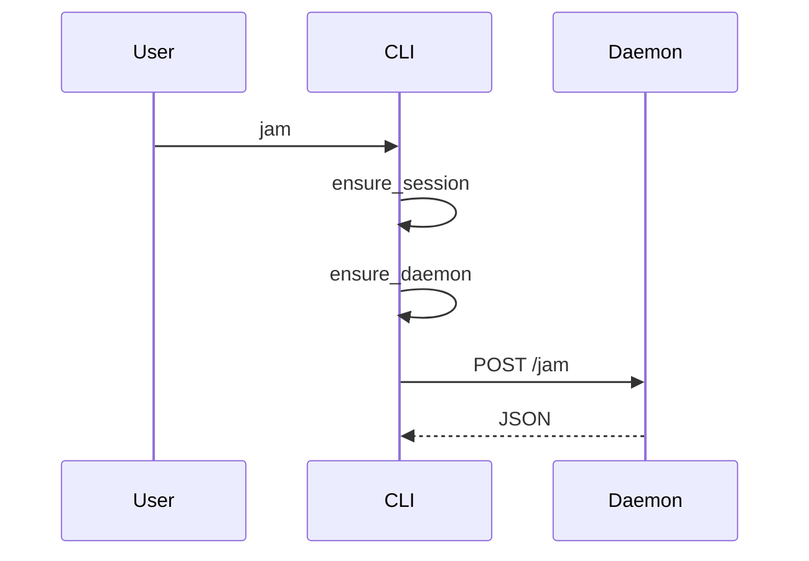

CLI client + localhost HTTP daemon. Host tooling (setup, statusline, skill) lives in `claude_dj/integrate/` and does not go through the daemon.

## Commands → HTTP

| CLI | HTTP |
|-----|------|
| setup | local only (config, OAuth, device, Claude Code) |
| jam | POST `/jam` (+ auth + spawn + statusline enable) |
| kill | POST `/kill` (+ statusline disable) |
| sync | POST `/sync` |
| device | GET `/devices` |
| device id | POST `/devices/{id}` |

Host/port from `claude_dj/config.py` (`127.0.0.1:8787`).[^1]

[^1]: claude_dj/cli.py; claude_dj/daemon/server.py; claude_dj/config.py
