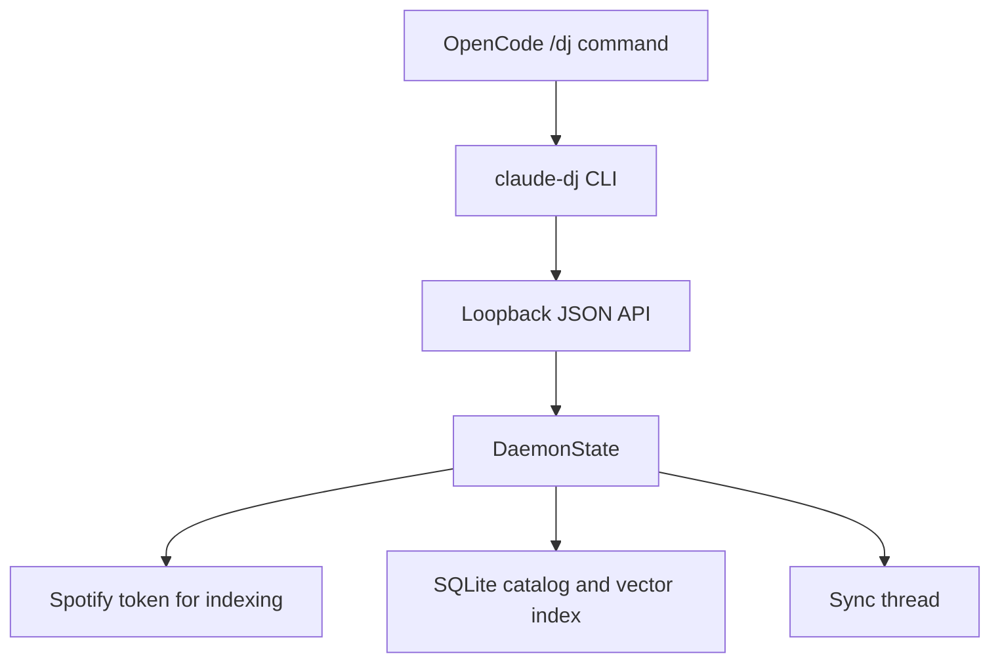

Claude DJ uses a long-running local daemon because catalog work has to continue after one `/dj` command returns. The OpenCode command and installed CLI stay thin; the daemon owns session attachment, catalog sync, status, and shutdown.[^1][^2]

## Runtime Shape

The daemon listens on loopback host `127.0.0.1` and records runtime metadata so later CLI commands can find the running process.[^1][^3]

## API Surface

| Endpoint | Owner | Purpose |
| --- | --- | --- |
| `GET /status` | Daemon | Return daemon, active session, catalog, sync, and indexing status. |
| `POST /session/start` | Daemon | Attach a local session and start or join background catalog sync. |
| `POST /sync/start` | Daemon | Start or join background catalog sync. |
| `POST /daemon/quit` | Daemon | Shut down the server. |

These routes are defined by the daemon request handler; the CLI talks to them through local JSON requests.[^1][^2]

## Catalog And Sync

The daemon keeps a local SQLite catalog and syncs in phases: Spotify playlist indexing, Deezer preview resolution, then local audio embedding generation. It chunks preview and embedding work in groups of 10. Session attachment does not wait for a catalog threshold.[^1]

## State Boundaries

| State | Location | Reason |
| --- | --- | --- |
| Runtime host, port, and PID | `runtime.json` in the app dir | Allows new CLI invocations to find the daemon. |
| Spotify token cache | `spotify-token.json` in the app dir | Keeps OAuth state out of the repo. |
| Preferred device | `spotify-device.json` in the app dir | Stores the selection made by `/dj device`; no daemon playback path currently consumes it. |
| Catalog and embeddings | `claude-dj.sqlite3` in the app dir | Stores playlist metadata, preview matches, and vector embeddings locally. |

The app directory defaults to `~/.claude-dj` and can be overridden with `CLAUDE_DJ_HOME`.[^3]

## Related Pages

- [Claude DJ](../entities/claude-dj.md)
- [Session Control](session-control.md)
- [Spotify Playback Orchestration](spotify-playback-orchestration.md)
- [Provider-Gated Audio Embeddings](provider-gated-audio-embeddings.md)

[^1]: daemon.py
[^2]: cli.py
[^3]: config.py
