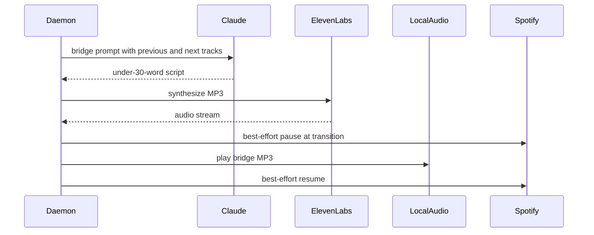

Narration is optional daemon-owned behavior. When ElevenLabs configuration is present, Claude DJ can prepare short bridge audio between Spotify blocks; when script generation, TTS, or local playback fails, music continues without narration.[^1][^2][^3]

## Current Flow

## Configuration

Narration is enabled only when both `ELEVENLABS_API_KEY` and `ELEVENLABS_VOICE_ID` are configured. The default ElevenLabs model id is `eleven_v3`, and the default output format is `mp3_44100_128`.[^4]

## Script Generation

The script prompt tells Claude DJ to act as a funny, personality-heavy radio DJ and return only the words the DJ should say. Bridge scripts must stay under 30 words and include the previous and next block track lists as context.[^3]

## Timing And Failure Behavior

| Situation | Behavior |
| --- | --- |
| Startup intro | Disabled for now to avoid delaying the first song. |
| Bridge prepared in time | Daemon can pause Spotify, play local bridge audio, then resume Spotify. |
| Bridge missing or late | Daemon clears pending bridge state and lets music continue. |
| Claude command missing, fails, or times out | Script generation returns `None`; narration is skipped. |
| ElevenLabs returns empty audio or HTTP error | TTS raises an error; narration is skipped by daemon-level handling. |

The daemon uses a one-second silence boundary and a five-second transition audio window for bridge timing.[^1]

## Future Controls

Future work should add explicit user controls for mute/unmute, voice selection, personality presets, frequency, and failure visibility. These should not expose API keys or clutter `/dj status` with secrets.

## Related Pages

- [Spotify Playback Orchestration](spotify-playback-orchestration.md)
- [Roadmap](../roadmap.md)

[^1]: daemon.py
[^2]: elevenlabs.py
[^3]: scripts.py
[^4]: config.py
