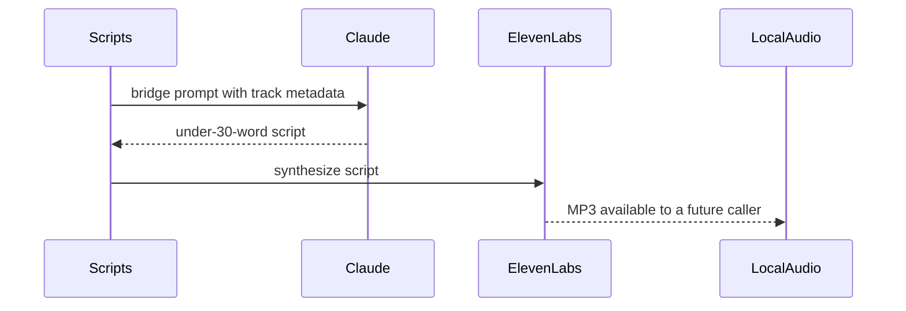

Narration prompt construction, Claude script generation, ElevenLabs synthesis, and local audio playback remain implemented and independently tested. The daemon no longer composes them with Spotify playback, so narration is not active runtime behavior.[^1][^2][^3]

## Preserved Components

## Configuration

Narration configuration is available only when both `ELEVENLABS_API_KEY` and `ELEVENLABS_VOICE_ID` are configured. The default ElevenLabs model id is `eleven_v3`, and the default output format is `mp3_44100_128`. No daemon path currently consumes that configuration.[^4]

## Script Generation

The script prompt tells Claude DJ to act as a funny, personality-heavy radio DJ and return only the words the DJ should say. Bridge scripts must stay under 30 words and include the previous and next block track lists as context.[^3]

## Future Controls

Future recommendation and playback design must first define who invokes narration and owns transition timing. Later controls can add mute/unmute, voice selection, personality presets, frequency, and failure visibility. These should not expose API keys or clutter `/dj status` with secrets.

## Related Pages

- [Spotify Playback Orchestration](spotify-playback-orchestration.md)
- [Roadmap](../roadmap.md)

[^1]: local_playback.py
[^2]: elevenlabs.py
[^3]: scripts.py
[^4]: config.py
