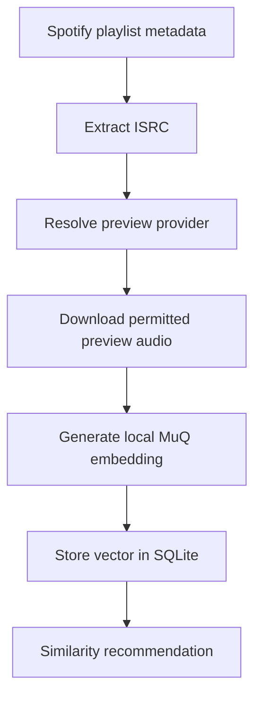

Claude DJ should only generate audio embeddings from a provider that gives usable preview or audio access and permits the intended local analysis and derived embedding storage. Spotify remains useful for catalog metadata and playback, but it is not the audio source for embeddings.[^1][^2]

## Current Pipeline

## Current Prototype

The current prototype resolves missing previews through Deezer using ISRC values. It stores preview-match rows with provider `deezer`, uses a community-observed 50 requests per 5 seconds rate limit, and reports matched, no-preview, not-found, no-ISRC, rate-limited, and failed counts.[^3]

Embedding generation uses a local MuQ preview embedder, decodes preview audio at 24 kHz, produces normalized embeddings, and stores vectors in the local SQLite catalog.[^4][^5]

## Product Rule

| Rule | Reason |
| --- | --- |
| Keep embeddings optional. | Baseline Spotify playback should work even without a rights-cleared audio source. |
| Keep Spotify as playback/catalog source only. | The product should not rely on Spotify audio or content as ML ingestion input. |
| Treat Deezer as prototype-only. | It is technically convenient for ISRC-to-preview matching but not a clean product default. |
| Store embeddings locally. | The app is local-first and avoids unnecessary remote music-derived state. |
| Revisit providers only with explicit rights. | Mainstream-catalog embeddings require clear contractual permission. |

## Current Implementation Facts

| Fact | Source |
| --- | --- |
| Default model name is `OpenMuQ/MuQ-large-msd-iter`. | `config.py` |
| Embedding dimensions are `1024`. | `config.py` and `db.py` |
| Preview decoding sample rate is `24_000`. | `embeddings.py` |
| Preview downloads are capped at 10 MB. | `embeddings.py` |
| Preview resolution is chunked by the daemon with `SYNC_CHUNK_SIZE = 10`. | `daemon.py` |

## Related Pages

- [Recommendation Loop](recommendation-loop.md)
- [Audio Source Provider Options](../comparisons/audio-source-provider-options.md)
- [Roadmap](../roadmap.md)

[^1]: config.py
[^2]: db.py
[^3]: previews.py
[^4]: embeddings.py
[^5]: daemon.py
