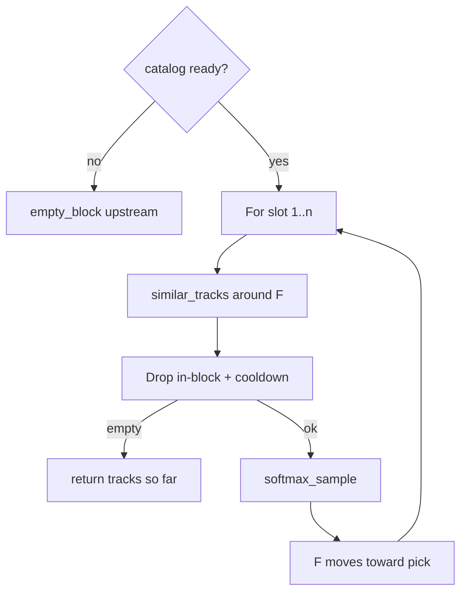

The recommender builds **blocks** for vibe continuity over the indexed catalog. Pure library at `claude_dj/recommend/engine.py`. Wired by [Session](../entities/session.md).

## Model

| Symbol | Meaning |
|--------|---------|
| **F** (focus) | Where the set is now (MuQ embedding) |
| **T** (taste) | Optional magnet from recent affinity tops |

## Product decisions

| Decision | Value |
|----------|--------|
| Goal | Vibe continuity; logical between-block drift |
| Unit | block size from recommend defaults |
| Pool | All `status=indexed` |
| Session start | Seed mode ~ U{short,medium,long,recently_played} → tops/recent ∩ indexed → F/T; else random |
| In-block | k-NN around F; score −dist(F) − w·dist(T); softmax; nudge F toward pick |
| Empty neighborhood | **End block early** (partial OK) |
| Between blocks | `advance_focus`: slide F toward T + noise |
| Cooldown | wall-clock map, caller-owned |

## Algorithm sketch

## Related

- [Recommend module](../entities/recommend-module.md)
- [Local storage](local-storage.md)
- [Catalog sync](catalog-sync.md)

[^1]: claude_dj/recommend/engine.py; tests/test_recommend.py
