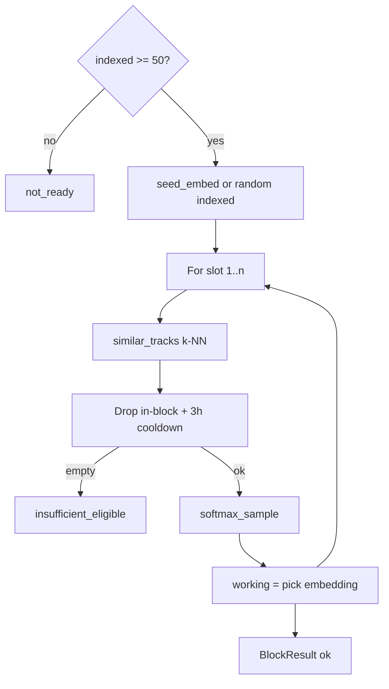

The recommender builds **blocks of 3–5 tracks** for flow/vibe continuity over the indexed catalog. It is a pure library called by the [orchestrator](../entities/orchestrator.md) on `/play` and when the virtual queue empties.

## Product decisions (locked)

| Decision | Value |
|----------|--------|
| Goal | Flow / vibe continuity |
| Unit | Block `n ∈ {3,4,5}`, default 5 |
| Pool | All `status=indexed` tracks |
| Cold seed | Uniform random indexed embedding |
| In-block pick | Softmax over −distance / τ (τ=0.15) |
| Cooldown | 3 hours wall-clock (caller-owned map) |
| Next-block seed | L2-normalize(0.5×last + 0.5×session_start) |
| Min catalog | Fail `not_ready` if indexed &lt; 50 |
| Partial blocks | No — full `n` or error |

## Algorithm sketch

## API (Python)

- `recommend_block(conn, n=5, seed_embed=..., session_start_embed=..., cooldown=..., now=..., tau=..., neighbor_k=..., rng=...)`
- `next_block_seed(last, session_start)`
- `apply_cooldown(cooldown, track_ids, now)` — **caller** applies after a block is used; recommend does not mutate cooldown.

## Surface

No dedicated CLI recommend command. Wired via orchestrator on `POST /play` / queue empty. Tests: `tests/test_recommend.py`. Module path: `backend/music/recommend.py`.[^1]

## Related

- [Recommend module](../entities/recommend-module.md)
- [Local storage](local-storage.md)
- [Catalog sync](catalog-sync.md)

[^1]: backend/music/recommend.py; tests/test_recommend.py

