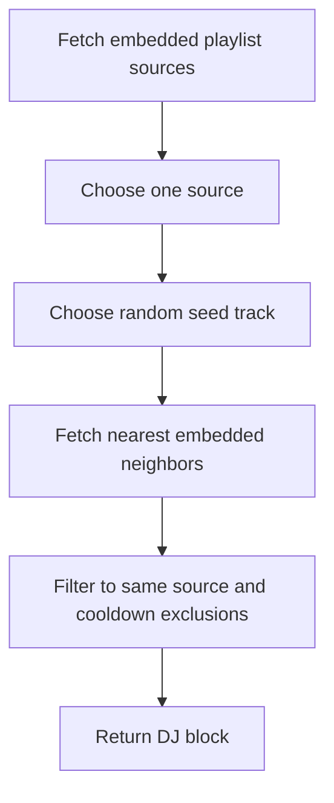

`recommendation/similarity.py` preserves a deterministic embedding-based implementation, but daemon and CLI production paths do not import or invoke it. It chooses a Spotify playlist source that has embedded tracks, selects a random embedded seed track from that source, finds nearby embedded tracks from the same source, and returns one DJ block for isolated callers and tests.[^1]

## Algorithm

## Current Parameters

| Parameter | Value | Source |
| --- | --- | --- |
| Minimum block size | `3` tracks | `MIN_DJ_BLOCK_SIZE` |
| Maximum block size | `6` tracks | `MAX_DJ_BLOCK_SIZE` |

The preserved code is the source of truth for block size. Any older `3-8` wording should be treated as stale and replaced with `3-6` unless the constants change.[^1]

## Data Dependencies

The recommender depends on `track_embeddings`, playlist membership, and track metadata in SQLite. The vector table uses `sqlite-vec`, stores 1024-dimensional embeddings, and is recreated if the configured embedding model or dimensions become incompatible.[^2]

## Exclusion Input

`generate_next_dj_block` accepts recently played track ids and excludes them unless that would eliminate all embedded candidates. No production component currently supplies this input or defines a cooldown duration.[^1]

## Non-Goals

- No runtime recommendation or playback composition is active today.
- No agentic planner chooses songs today.
- No user preference history is persisted yet.
- No genre, mood, or free-text steering is wired into the recommender yet.
- No provider-agnostic mainstream-catalog embeddings are assumed.

Future steering belongs in [Roadmap](../roadmap.md) until code supports it.

[^1]: similarity.py
[^2]: db.py
