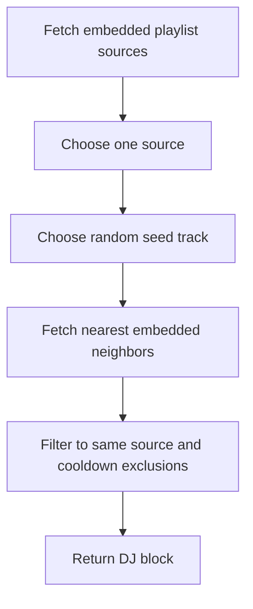

The current recommendation loop is deterministic and embedding-based, not agentic. It chooses a Spotify playlist source that has embedded tracks, selects a random embedded seed track from that source, finds nearby embedded tracks from the same source, and returns one DJ block.[^1]

## Algorithm

## Current Parameters

| Parameter | Value | Source |
| --- | --- | --- |
| Minimum block size | `3` tracks | `MIN_DJ_BLOCK_SIZE` |
| Maximum block size | `6` tracks | `MAX_DJ_BLOCK_SIZE` |
| Recent-track cooldown | `3` hours | `TRACK_COOLDOWN` |
| Ready threshold before playback | `30` ready tracks | `MIN_READY_TRACKS` |

The code is the current source of truth for block size. Any older `3-8` wording should be treated as stale and replaced with `3-6` unless the constants change.[^1][^2]

## Data Dependencies

The recommender depends on `track_embeddings`, playlist membership, and track metadata in SQLite. The vector table uses `sqlite-vec`, stores 1024-dimensional embeddings, and is recreated if the configured embedding model or dimensions become incompatible.[^3]

## Cooldown Behavior

The daemon passes recently played track ids into `generate_next_dj_block`. The recommender excludes recently played embedded tracks unless that exclusion would eliminate all embedded candidates, in which case it falls back to available embedded tracks instead of returning no music.[^1][^2]

## Non-Goals

- No agentic planner chooses songs today.
- No user preference history is persisted yet.
- No genre, mood, or free-text steering is wired into the recommender yet.
- No provider-agnostic mainstream-catalog embeddings are assumed.

Future steering belongs in [Roadmap](../roadmap.md) until code supports it.

[^1]: similarity.py
[^2]: daemon.py
[^3]: db.py
