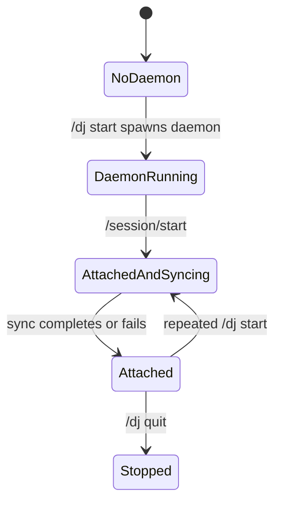

Session control is the boundary between a user issuing `/dj` commands and the daemon owning background catalog work. Current behavior is intentionally simple: `/dj start` sends session id `local-cli`, and the daemon records that value as the active session.[^1][^2]

## Current Behavior

Repeated `/session/start` calls update the active session id and join the existing sync thread when sync is already running.[^2]

## Current State Fields

| Field | Meaning |
| --- | --- |
| `active_session_id` | Session id last written by `/session/start`; currently `local-cli` from the CLI. |
| `sync_status` | Current catalog-sync lifecycle state. |
| `sync_thread` | At most one background catalog-sync worker. |
| `sync_indexing` | Latest Spotify, preview, and embedding phase summaries. |

These fields live in the daemon's in-memory `DaemonState`.[^2]

## Planned Semantics

| Command | Intended meaning | Current status |
| --- | --- | --- |
| `/dj stop` | Stop future active music automation without necessarily shutting down the daemon. | Not implemented. |
| `/dj detach` | Disconnect this OpenCode session while leaving daemon state intact. | Not implemented. |
| `/dj takeover` | Move active control to this session when another session owns the daemon. | Not implemented. |
| `/dj quit` | Shut down the daemon process. | Implemented. |

These planned controls should be implemented before Claude DJ supports meaningful multi-session ownership. Until then, current behavior is local-single-controller oriented.

## Update Rule

If session ownership behavior changes, update this page and [Claude DJ](../entities/claude-dj.md) in the same change. Keep planned controls in [Roadmap](../roadmap.md) until code supports them.

[^1]: cli.py
[^2]: daemon.py
