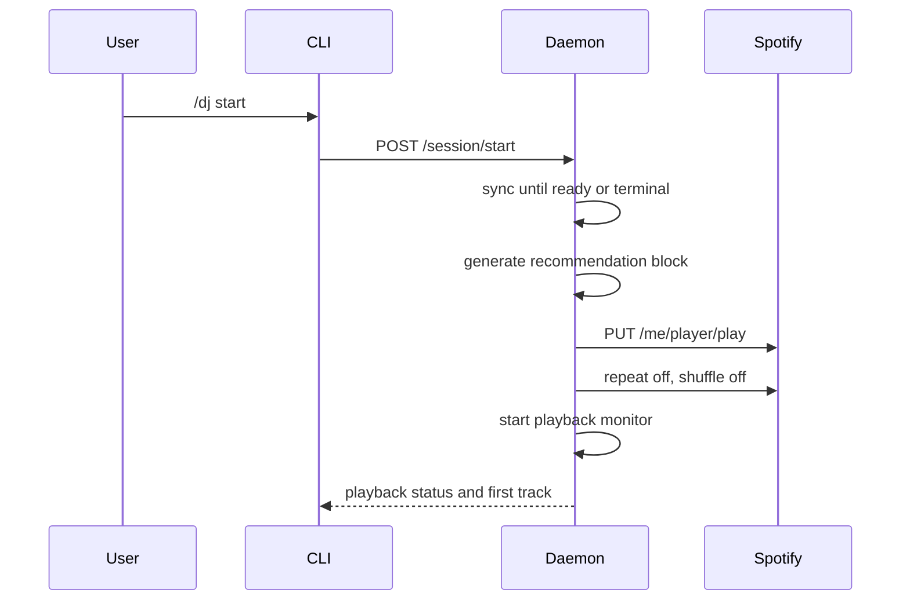

Spotify playback orchestration starts when `/dj start` reaches `POST /session/start`. The daemon syncs catalog data if needed, waits until there are at least 30 ready tracks or sync reaches a terminal state, generates a recommendation block, hydrates internal track ids to Spotify URIs, and starts playback through the device policy.[^1]

## Start Flow

## Device Policy

If Spotify accepts playback on the active device, no fallback device is recorded. If Spotify reports no active device, Claude DJ fetches available Spotify Connect devices and only starts playback on a saved preferred device when that exact id, or the same name/type pair, is currently usable.[^2]

When no usable saved preference is available, Claude DJ returns a numbered device list and asks the user to run `/dj device <number>`, then retry `/dj start`.[^2]

## Playback Options

After a generated block starts, the daemon sets Spotify repeat mode to `off` and shuffle to `False`. This keeps generated blocks deterministic instead of letting Spotify repeat or shuffle the queue.[^1][^3]

## Monitor And Queue-Ahead

The playback monitor polls Spotify every 5 seconds. It tracks the daemon's known Spotify URI sequence and appends a fresh independent block when the known sequence has 2 or fewer tracks remaining after the current track.[^1]

| Constant | Value | Meaning |
| --- | --- | --- |
| `PLAYBACK_POLL_SECONDS` | `5.0` | Monitor interval. |
| `QUEUE_REPLENISH_THRESHOLD_TRACKS` | `2` | Queue-ahead threshold. |
| `MIN_READY_TRACKS` | `30` | Ready-track threshold before playback is attempted. |

Spotify does not expose a queue-clearing API in this implementation, so Claude DJ appends future tracks with `POST /me/player/queue` rather than promising to replace the visible Spotify queue.[^1][^3]

## Failure Behavior

| Failure | Behavior |
| --- | --- |
| Missing Spotify login | CLI tells the user to run `/dj spotify-login`. |
| No active device and no saved available preference | CLI shows available devices and asks for `/dj device <number>`. |
| Spotify denies playback control | Adapter raises a playback-forbidden error for caller handling. |
| Monitor cannot append a block | Daemon records playback monitor error and leaves current music alone. |

## Related Pages

- [Spotify Adapter](../entities/spotify-adapter.md)
- [Recommendation Loop](recommendation-loop.md)
- [Optional Narration](optional-narration.md)

[^1]: daemon.py
[^2]: devices.py
[^3]: spotify.py
