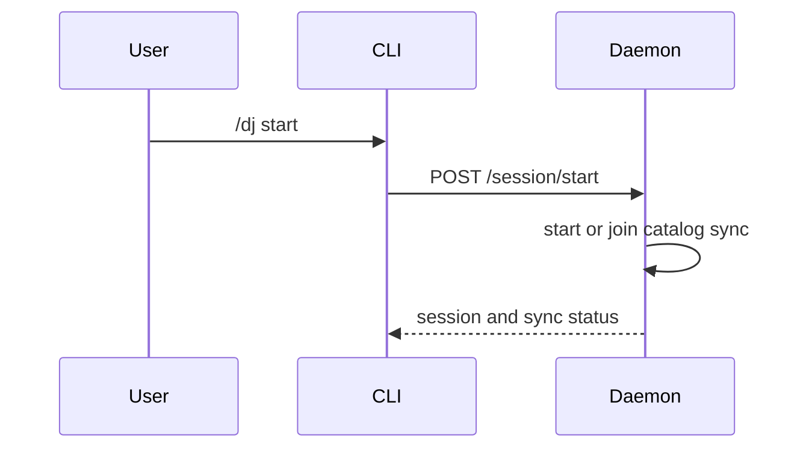

Claude DJ currently has no daemon-owned Spotify playback orchestration. `/dj start` attaches a session and starts background catalog sync; it does not choose tracks, hydrate a block, start playback, change repeat or shuffle, monitor playback, or append queue items.[^1][^2]

## Preserved Primitives

The Spotify adapter and device module still provide independently tested operations:

| Primitive | Owner |
| --- | --- |
| Start playback from Spotify URIs | `spotify.py` and `devices.py` |
| Read current playback state | `spotify.py` |
| Append one URI to the queue | `spotify.py` |
| Set repeat and shuffle | `spotify.py` |
| Pause and resume playback | `spotify.py` |
| Discover Spotify Connect devices | `spotify.py` |
| Save and load a preferred device | `devices.py` |

These functions are available to a future playback owner. Keeping them does not preserve the deleted daemon contract.

## Current Command Behavior

`/dj devices` and `/dj device <number>` remain direct CLI operations for discovering and storing a preferred device. No current `/dj start` path consumes that preference.[^2][^3]

## Removed Composition

The previous generated-block flow included a 30-track threshold, recommendation generation, device-policy playback start, repeat and shuffle normalization, queue lookahead, playback polling, and narration handoffs. That composition was removed so the replacement recommendation system can define explicit selection and playback interfaces without inheriting daemon state.

## Future Design Questions

- Which component owns the active sequence of tracks?
- Does playback consume full blocks, one track at a time, or a provider-native context?
- How are user queue edits and skips reconciled?
- Where do feedback, cooldowns, and transition narration belong?
- Which playback actions should run in the daemon rather than a separate controller?

## Related Pages

- [Spotify Adapter](../entities/spotify-adapter.md)
- [Recommendation Loop](recommendation-loop.md)
- [Optional Narration](optional-narration.md)
- [Roadmap](../roadmap.md)

[^1]: daemon.py
[^2]: cli.py
[^3]: devices.py
