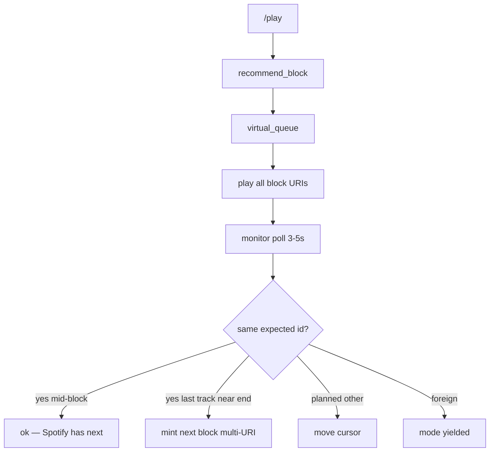

Playback treats Spotify as a **dumb speaker**. The app owns a **virtual queue** of planned tracks; Spotify is loaded with the **current block as multi-URI play** (so skip works) and is polled for state.

## Why

- No reliable clear/remove on Spotify’s native “Up Next” queue → we **replace** play context with our block URIs, not append via `addToQueue`
- No playback webhooks → must poll `GET /me/player`
- Single-URI play breaks client skip (no next) → **multi-URI block load**
- Users can still play foreign tracks → yield

## Modes

| Mode | Meaning |
|------|---------|
| `idle` | Not DJing |
| `attached` | Controlling; monitor ticks |
| `yielded` | Saw foreign track; stopped injecting until `/play` again |

## Flow

## Skip behavior

- Skip **within** block → Spotify advances multi-URI list; monitor reconciles cursor, stay attached  
- Skip/land **outside** plan → yield  
- Near end of **last** planned track → mint next block and multi-URI load it  

## Device targeting

Preferred id from `~/.claude-dj/device.json` if set; else Spotify active device. List/select via `claude-dj device`.[^1]

## Related

- [Orchestrator](../entities/orchestrator.md)
- [Playback module](../entities/playback-module.md)
- [Recommendation blocks](recommendation-blocks.md)

[^1]: backend/adapters/spotify.py; backend/music/playback.py; backend/orchestrator.py

