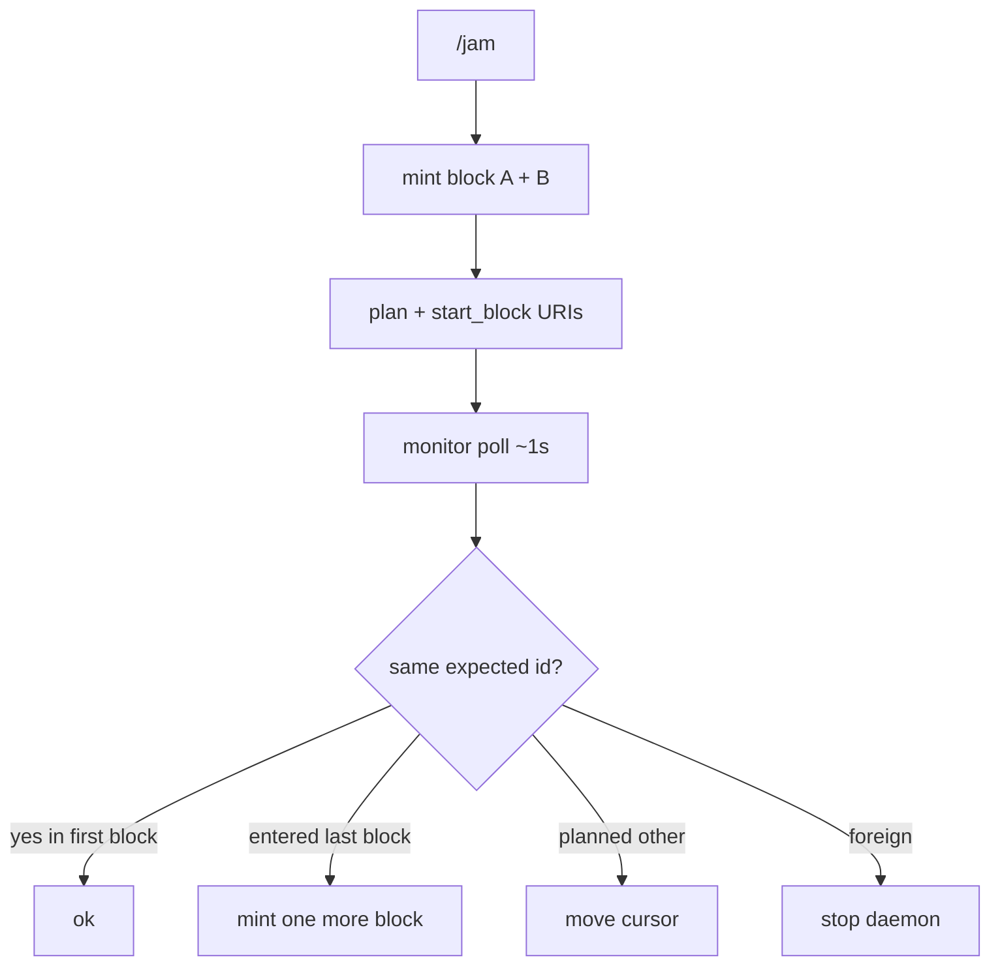

Playback treats Spotify as a **dumb speaker**. The app owns a **virtual queue** of planned tracks; Spotify receives multi-URI blocks and is polled for state.

## Why

- No reliable clear/remove on Spotify’s native queue
- No playback webhooks → poll `GET /me/player`
- Users can skip or play foreign tracks anytime

## Modes

| Mode | Meaning |
|------|---------|
| `idle` | Not DJing |
| `attached` | Controlling; monitor ticks |

Foreign track → stop daemon via monitor (not a long-lived “yielded” mode).

## Flow

## Buffer rule

Always keep **two blocks** loaded when possible: cold jam mints two; when the cursor enters the last loaded block, mint exactly one more. Pause never mints.

## Device targeting

Preferred id from `~/.claude-dj/device.json` if set; else Spotify active device. Set during `dj setup` or `dj device`.[^1]

## Related

- [Session](../entities/session.md)
- [Playback module](../entities/playback-module.md)
- [Recommendation blocks](recommendation-blocks.md)

[^1]: claude_dj/adapters/spotify/; claude_dj/playback/port.py; claude_dj/session/
