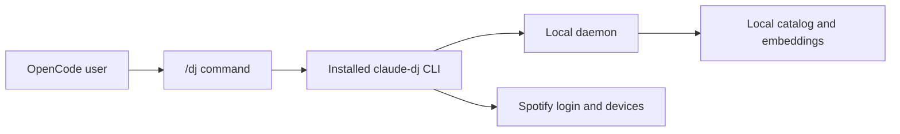

Claude DJ is a local OpenCode companion for coding sessions. It installs a persistent `claude-dj` CLI and a global `/dj` OpenCode command. The current daemon keeps catalog sync alive beyond a single command invocation while recommendation and playback composition are rebuilt.[^1][^2]

## Product Boundary

Claude DJ is a music companion, not a coding agent. It does not write or modify code, and its product surface should stay focused on music playback, catalog sync, recommendation, device selection, optional narration, and explicit user controls.[^3]

## Install And Runtime

The installer uses `uv tool install --force` when `uv` is available and falls back to `pipx install --force`; it also writes `~/.config/opencode/command/dj.md` so `/dj` calls the installed CLI instead of a project checkout.[^2]

Runtime state lives outside the repo. By default, Claude DJ stores daemon runtime info, the SQLite catalog, the Spotify token cache, preferred Spotify device, narration audio, and optional `.env` config under `~/.claude-dj`; `CLAUDE_DJ_HOME` can override that app directory.[^4]

## Current Command Surface

| Command | Current behavior |
| --- | --- |
| `/dj` or `/dj status` | Show daemon, sync, catalog, model, and last-run status. |
| `/dj spotify-login` | Run Spotify PKCE login and save the local token cache. |
| `/dj start` | Start or attach to the daemon and start or join background catalog sync. |
| `/dj sync` | Start or join background catalog sync. |
| `/dj devices` | List visible Spotify Connect devices. |
| `/dj device <number>` | Save a preferred Spotify Connect device. |
| `/dj quit` | Ask the daemon to shut down. |

The parser currently accepts exactly `start`, `sync`, `status`, `quit`, `spotify-login`, `devices`, and `device`.[^5]

## Current Gaps

Recommendation composition and automatic Spotify playback are also current gaps. The planned command surface still includes stop, skip, vibe steering, detach, and takeover semantics. Those belong in [Roadmap](../roadmap.md) until implemented so planned behavior does not blur into current behavior.

## Related Pages

- [Local Daemon Architecture](../concepts/local-daemon-architecture.md)
- [Session Control](../concepts/session-control.md)
- [Spotify Playback Orchestration](../concepts/spotify-playback-orchestration.md)
- [Roadmap](../roadmap.md)

[^1]: README.md
[^2]: installer.py
[^3]: README.md
[^4]: config.py
[^5]: cli.py
