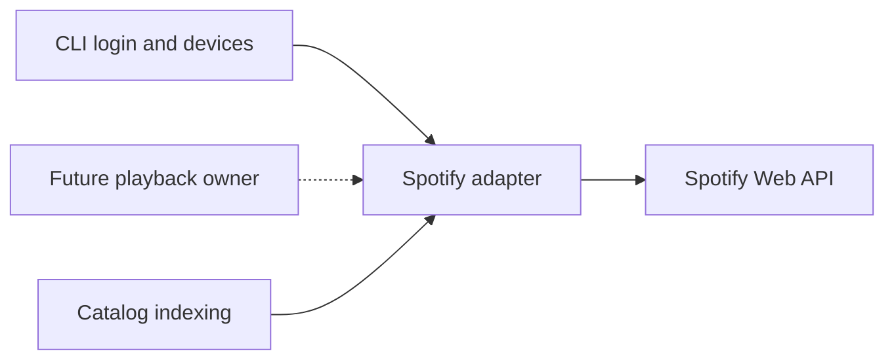

The Spotify adapter owns low-level Spotify Web API interactions. Catalog indexing and CLI login/device commands actively use part of this surface. No current production component composes the playback methods into automatic music control.[^1][^2][^3]

## Responsibilities

| Area | Current support |
| --- | --- |
| OAuth | PKCE login and token-cache refresh flow. |
| Devices | Fetch visible Spotify Connect devices and normalize them. |
| Playback start | Send `PUT /me/player/play` with an optional device id. |
| Playback state | Fetch current playback state for monitoring. |
| Queue append | Add one Spotify URI to the queue. |
| Playback options | Set repeat mode and shuffle state. |
| Pause/resume | Pause and resume current playback for narration transitions. |
| Playlists | Fetch playlists and playlist items for catalog sync. |

## Boundary

The adapter exposes Spotify-specific operations. `devices.py` retains preferred-device policy, but no daemon playback path currently invokes either playback surface.[^3]

## Current Missing Playback Controls

| Control | Status |
| --- | --- |
| Transfer playback | Not implemented. |
| Skip current track | Not implemented. |
| Clear or replace queue | Not available through the current adapter; queueing appends only. |
| Rich user feedback | Not implemented. |

These gaps should stay in [Roadmap](../roadmap.md) until there is code support.

[^1]: spotify.py
[^2]: cli.py
[^3]: devices.py
