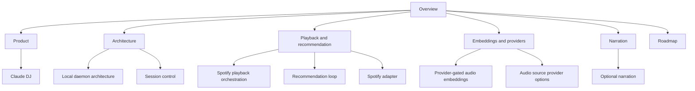

This wiki is the single project knowledge base for Claude DJ. New ideas should update the nearest existing wiki page, wrong claims should be corrected in place, and only genuinely new concepts or entities should get new pages.

## Scope

- Wiki page count: 12 canonical pages after the legacy-note merge.
- Source layer: code, tests, package metadata, and `README.md` remain evidence for implementation facts.
- Canonical layer: `wiki/` owns product intent, architecture, provider research, roadmap, and operating decisions.
- Archive layer: git history preserves old context files after deletion.

## Knowledge Map

## Start Here

| Question | Page |
| --- | --- |
| What is Claude DJ? | [Claude DJ](entities/claude-dj.md) |
| Why is there a daemon? | [Local Daemon Architecture](concepts/local-daemon-architecture.md) |
| How does session ownership work? | [Session Control](concepts/session-control.md) |
| How does `/dj start` control Spotify? | [Spotify Playback Orchestration](concepts/spotify-playback-orchestration.md) |
| How are recommendations chosen? | [Recommendation Loop](concepts/recommendation-loop.md) |
| What does the Spotify adapter own? | [Spotify Adapter](entities/spotify-adapter.md) |
| What is the embedding-source policy? | [Provider-Gated Audio Embeddings](concepts/provider-gated-audio-embeddings.md) |
| Which audio providers have been considered? | [Audio Source Provider Options](comparisons/audio-source-provider-options.md) |
| How does narration work? | [Optional Narration](concepts/optional-narration.md) |
| What is planned next? | [Roadmap](roadmap.md) |

## Key Current Facts

| Fact | Canonical page | Evidence |
| --- | --- | --- |
| Claude DJ installs as a persistent CLI and global OpenCode `/dj` command. | [Claude DJ](entities/claude-dj.md) | README and installer code.[^1][^2] |
| The CLI currently accepts `start`, `sync`, `status`, `quit`, `spotify-login`, `devices`, and `device`. | [Claude DJ](entities/claude-dj.md) | CLI parser.[^3] |
| The local daemon owns sync, recommendation, playback monitoring, and optional narration. | [Local Daemon Architecture](concepts/local-daemon-architecture.md) | Daemon state and handlers.[^4] |
| The recommendation block size is currently 3-6 tracks. | [Recommendation Loop](concepts/recommendation-loop.md) | Similarity constants.[^5] |
| Optional narration uses Claude-generated scripts and ElevenLabs audio when configured. | [Optional Narration](concepts/optional-narration.md) | Narration script and TTS adapters.[^6][^7] |

## Maintenance Rule

Update the wiki directly. Do not create a parallel product-note tree; this wiki is the canonical knowledge store.

## Recent Updates

- 2026-07-08: Merged legacy product, architecture, future-plan, provider, and narration notes into canonical llmwiki pages.
- 2026-07-08: Initialized the repo-local llmwiki scaffold and indexed repository sources.

[^1]: README.md
[^2]: installer.py
[^3]: cli.py
[^4]: daemon.py
[^5]: similarity.py
[^6]: scripts.py
[^7]: elevenlabs.py
