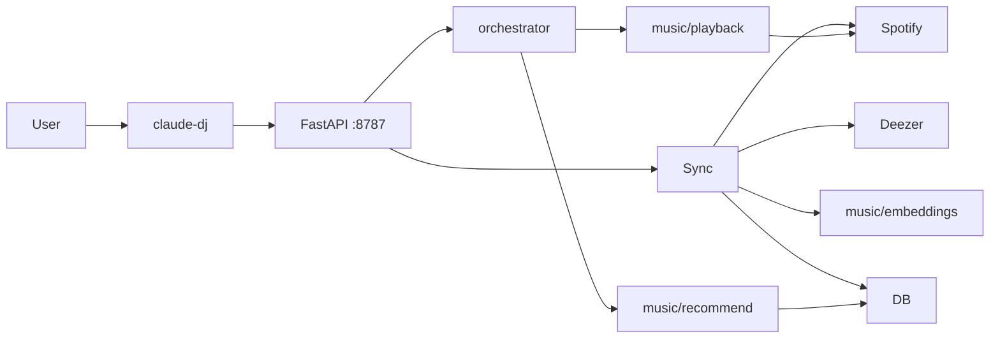

Claude DJ is a **local OpenCode companion** that indexes owned Spotify playlists into MuQ-MuLan embeddings, mints vibe-continuity **blocks**, and plays them on Spotify Connect via a **virtual queue** (ElevenLabs narration still future).

## Scope

Current `backend/` on `algorithm-v1` (2026-07-14). Ground truth: code + tests + README.

| Layer | Role |
|-------|------|
| OpenCode `/dj` | Passes args to installed `claude-dj` |
| CLI | Auth, spawn daemon, HTTP client |
| Daemon | REST + catalog sync kick + orchestrator + monitor |
| Sync + storage | Owned playlists → Deezer preview → embed → sqlite-vec |
| `backend/music/` | embeddings, recommend, playback ports |
| Orchestrator | Virtual queue, modes idle/attached/yielded, tick reconcile |

## Commands

`play` · `status` · `sync` · `device` · `device <id>` · `quit`

- **`play`**: session + daemon + kick sync + mint block when ≥50 indexed + start Spotify (or `not_ready`)
- **`device`**: list Connect devices; optional id saved to `~/.claude-dj/device.json`
- No separate `init` / `spotify-login` / recommend CLI

## Key findings

1. End-to-end music path is wired: catalog → recommend → virtual queue → Connect multi-URI block + poll monitor.[^1]
2. Recommend needs **≥50 indexed** tracks; cold seed from Spotify tops (rank-softmax); next block L2(0.7 last + 0.3 short_term recency).[^2]
3. Spotify native queue is **not** the source of truth; app owns the plan; foreign tracks → **yield**.[^3]
4. Package layout: control in top-level modules; music logic under `backend/music/`.[^4]
5. Paths: tokens + preferred device + DB under `~/.claude-dj/`.[^5]

## Architecture

## Recent updates

- **2026-07-14 (later):** Orchestrator, virtual-queue playback, device preference, `backend/music/` rename, daemon log on spawn failures.
- **2026-07-14:** Wiki rebuild for play-centric CLI + catalog + pure recommend.

## Page index

### Concepts
- [Control plane](concepts/control-plane.md)
- [Catalog sync](concepts/catalog-sync.md)
- [Recommendation blocks](concepts/recommendation-blocks.md)
- [Virtual queue playback](concepts/virtual-queue-playback.md)
- [Local storage](concepts/local-storage.md)

### Entities
- [claude-dj CLI](entities/claude-dj-cli.md)
- [Daemon](entities/daemon.md)
- [Orchestrator](entities/orchestrator.md)
- [Spotify adapter](entities/spotify-adapter.md)
- [Deezer adapter](entities/deezer-adapter.md)
- [MuQ embeddings](entities/muq-embeddings.md)
- [Recommend module](entities/recommend-module.md)
- [Playback module](entities/playback-module.md)
- [Catalog database](entities/catalog-database.md)

[^1]: backend/daemon.py; backend/orchestrator.py; backend/music/playback.py
[^2]: backend/music/recommend.py
[^3]: docs/superpowers/specs/2026-07-14-playback-virtual-queue-design.md; backend/orchestrator.py
[^4]: backend/music/
[^5]: backend/config.py

