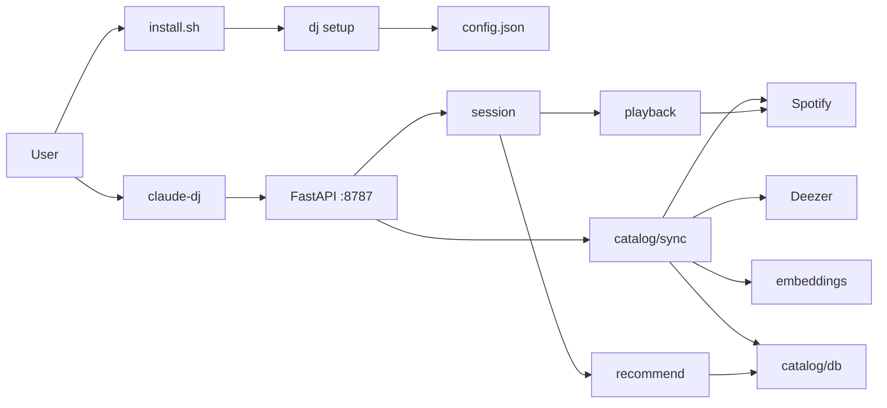

Claude DJ is a **local Spotify companion** for coding sessions: indexes owned playlists into MuQ-MuLan embeddings, mints Focus+Taste **blocks**, and plays them on Spotify Connect via a **virtual queue**. Claude Code gets a statusline row and `/dj` skill after setup.

## Scope

Package root is **`claude_dj/`** (formerly `backend/`). Branch `algorithm-v1`. Ground truth: code + tests + README.

| Layer | Path / role |
|-------|-------------|
| Install | `install.sh` → `uv tool install` → `dj setup` |
| CLI | `claude_dj/cli.py` — auth client, spawn daemon, HTTP |
| Integrate | `claude_dj/integrate/` — setup wizard, statusline, `/dj` skill |
| Daemon | `claude_dj/daemon/server.py` — FastAPI + monitor |
| Session | `claude_dj/session/` — Plan + Session (mint/reconcile) |
| Catalog | `claude_dj/catalog/` — sqlite + sync |
| Recommend | `claude_dj/recommend/` — Focus + Taste blocks |
| Playback | `claude_dj/playback/` — ports + Spotify/Fake |
| Embeddings | `claude_dj/embeddings/` — MuQ-MuLan |
| Adapters | `claude_dj/adapters/` — Spotify, Deezer |

## Commands

`setup` · `jam` · `kill` · `sync` · `device` · `device <id>` · `help`

- **`setup`**: client ID → Spotify login → device → statusline → `/dj` skill → MuQ
- **`jam`**: enable statusline + session + daemon + kick sync + mint pair of blocks + Connect
- **`kill`**: stop daemon + disable statusline (Spotify keeps playing)
- Client ID: env `SPOTIFY_CLIENT_ID` **or** `~/.claude-dj/config.json` (no shell export required)

## Key findings

1. End-to-end path: catalog → recommend → virtual queue → Connect multi-URI blocks + 1s monitor.[^1]
2. Cold jam loads **two blocks**; when the cursor enters the last loaded block, mint **one** more (always two ahead).[^2]
3. Spotify native queue is **not** SoT; foreign track → stop daemon.[^3]
4. Layered package `claude_dj/` with host tooling under `integrate/`.[^4]
5. Durable state under `~/.claude-dj/` including `config.json`.[^5]

## Architecture

## Recent updates

- **2026-07-18:** Architecture 1 — rename `backend` → `claude_dj/`; session/catalog/recommend/playback/embeddings/integrate split.
- **2026-07-18:** Streamlined install (`install.sh` + setup wizard + durable client ID + Claude Code skill).
- **2026-07-18:** Two-block buffer refill (enter last block → mint one).

## Page index

### Concepts
- [Control plane](concepts/control-plane.md)
- [Catalog sync](concepts/catalog-sync.md)
- [Recommendation blocks](concepts/recommendation-blocks.md)
- [Virtual queue playback](concepts/virtual-queue-playback.md)
- [Local storage](concepts/local-storage.md)

### Entities
- [claude-dj CLI](entities/claude-dj-cli.md)
- [Daemon](entities/daemon.md)
- [Session](entities/session.md)
- [Spotify adapter](entities/spotify-adapter.md)
- [Deezer adapter](entities/deezer-adapter.md)
- [MuQ embeddings](entities/muq-embeddings.md)
- [Recommend module](entities/recommend-module.md)
- [Playback module](entities/playback-module.md)
- [Catalog database](entities/catalog-database.md)

[^1]: claude_dj/daemon/server.py; claude_dj/session/; claude_dj/playback/port.py
[^2]: claude_dj/session/session.py
[^3]: claude_dj/session/plan.py
[^4]: claude_dj/
[^5]: claude_dj/config.py
