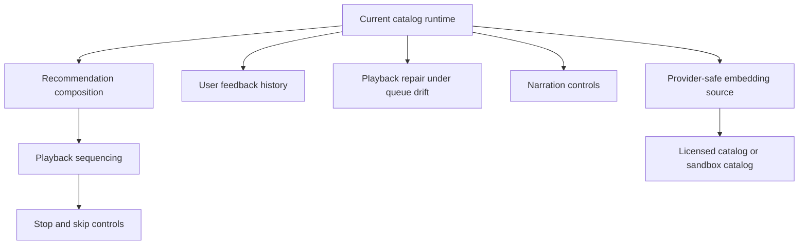

This page is the canonical future-work list for Claude DJ. New ideas should update this page or the nearest concept page directly; do not create a separate parallel note.

## Near-Term Playback Controls

| Planned command | Purpose | Depends on |
| --- | --- | --- |
| `/dj stop` | Stop future active automation without necessarily shutting down the daemon. | Replacement playback owner and session lifecycle. |
| `/dj skip` | Skip current track and record that the user wanted a change. | Spotify skip support and feedback storage. |
| `/dj vibe` | Steer the current music direction. | Preference model and recommendation inputs. |
| `/dj detach` | Disconnect this OpenCode session while leaving daemon alive. | Multi-session session model. |
| `/dj takeover` | Explicitly take control when another session is active. | Multi-session ownership checks. |

These commands are not part of the current CLI parser and should not be documented as implemented until code changes.[^1]

## Implementation Gaps

Current important gaps:

- Transfer playback and skip are not implemented in the Spotify adapter.
- Session control is minimal and currently uses `local-cli` as the active session id.
- Persistent decision history and feedback history are not implemented.
- The preserved embedding-similarity implementation is not wired into daemon or CLI runtime behavior.
- No replacement component currently owns recommendation policy or Spotify playback sequencing.
- Provider-safe mainstream-catalog embeddings remain unresolved.

## Mood Detection

Mood detection should remain opt-in and out of the baseline MVP. Any camera, microphone, biometric-like, or coding-session signal analysis needs a separate design review, local-first defaults, clear controls, and explicit user consent.

Potential future signals:

| Signal | Constraint |
| --- | --- |
| Facial expression or posture | Local model by default; no silent remote upload. |
| Voice, humming, or ambient energy | Explicit opt-in; inspectable and disableable. |
| Coding-session state | Avoid sending broad coding context to narration or music providers. |
| Positive engagement signals | Treat as optional hints, not required inputs. |

## Embedding Future Path

1. Keep baseline DJ useful through Spotify metadata, playback state, feedback, skips, and commands.
2. Keep local vector search optional.
3. Populate embeddings only from audio sources with explicit rights.
4. Use sandbox catalogs such as licensed Feed Originals with permission, MTG-Jamendo, or Freesound only when their license fits the use.
5. Revisit SourceAudio, MassiveMusic, Tuned Global, or Feed.fm custom terms only if the project becomes funded or requires mainstream catalog embeddings.

## Update Rule

When an idea becomes implemented, move it from this roadmap into the relevant current-state page and cite the implementing code. When implementation contradicts this page, implementation wins and this page should be corrected.

[^1]: cli.py
